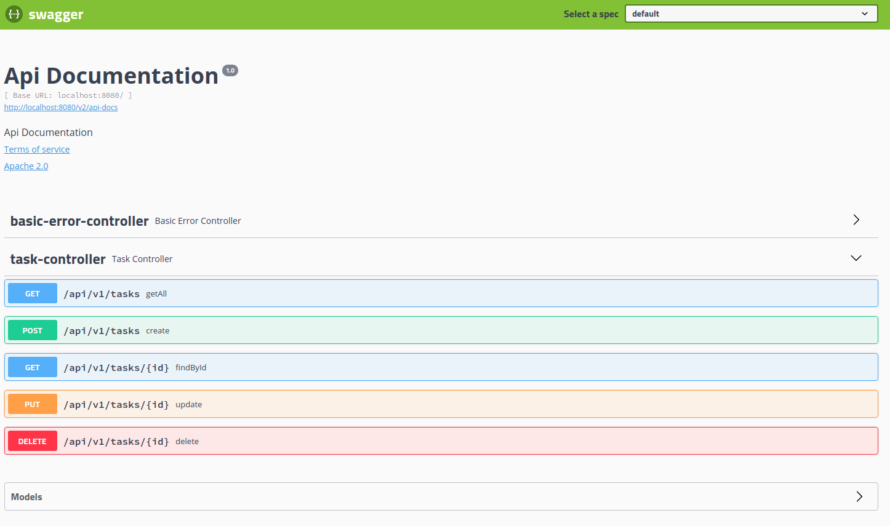

# Tasks API

With this API you can list, create, update and delete tasks.

# Requirements

- Docker
- Docker-compose

# How to run

With the help of docker-compose you can run the command below

```docker-compose up -d```

# API Documentation

Swagger was used for API documentation. Once you have finished executing the above command you can go to http://localhost:8080/swagger-ui.html#/task-controller.


